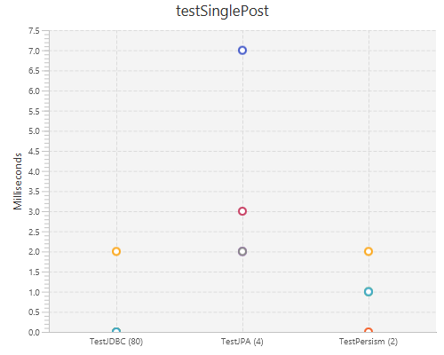
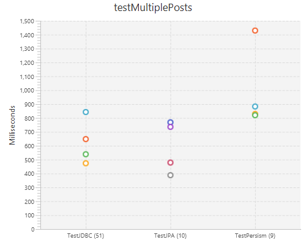
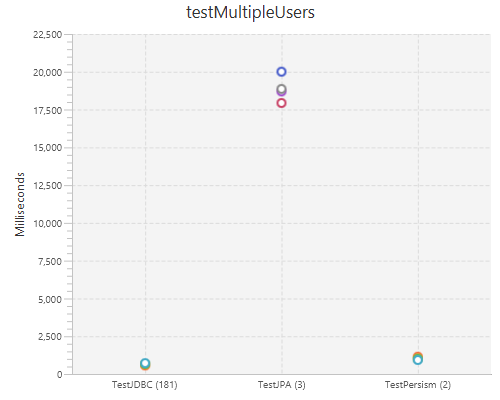

#   Handling table joins with Persism

Virtually all ORMs out there have mechanisms to support some kind of join or relationship 
where you have - let's say a Customer object which has a List of Invoice objects. 
Persism has not had anything much to say about this - leaving it up to you to handle this 
situation on your own.

The reason for this mainly was I wanted to avoid the "impedance mismatch" problems inherent 
when you are combining OO/Procedural languages with SQL - which is a declarative query 
language.

Now as of Persism 2.1.0 we have a new @Join annotation to accomplish this without the
impedance mismatch and [Select N+1](n+1.md) problems.

## Example usage

There are 4 types of joins in SQL
* One to One
* One to Many
* Many to One
* Many to Many

Let's take a common example of Customers who have Invoices with LineItems which point to Products.

Our models will look like this:

```java
public final class Customer {
    private String id; // primary key
    private String customerName;
    private short status;
    private String region;
    private String country;

    private List<Invoice> invoices = new ArrayList<>();
    
    // getters/setters etc...
}

public final class Invoice {
    private int id; // primary key
    private String customerId; // foreign key to Customers
    private short status;
    private Date invoiceDate;
    private double total;
    
    private List<LineItem> lineItems = new ArrayList<>();
    
    // getters/setters etc...   
} 

public final class LineItem {
    private int id; // primary key
    private int invoiceId; // foreign key to Invoices
    private int productId; // foreign key to Products
    private int quantity;
    private double price;     

    private Product product;

    // getters/setters etc...
} 

public final class Product {
    private int id; // primary key
    private String description;
    private double price;

    // getters/setters etc...
} 
```

In order to wire up the joins we'll use the new @Join annotation.

```java
public final class Customer {
    private String id; 
    private String customerName;
    private short status;
    private String region;
    private String country;

    @Join(to = Invoice.class, onProperties = "Id", toProperties = "customerId")
    private List<Invoice> invoices = new ArrayList<>();
    
    // getters/setters etc...
}
```

* The "to" attribute specifies the class of the POJO we're joining to. 
* The "onProperties" attribute specifies the property name from this POJO to join from. 
* The "toProperties" attribute specifies the property name of the target POJO to join to.    

**Note:** Property names are case-insensitive.

If you are joining on multiple properties (columns), separate the property names with a comma.
For example:

```java
public final class Customer {
    private String id; 
    private String customerName;
    private short status;
    private String region;
    private String country;

    @Join(to = Invoice.class, onProperties = "Id, Status", toProperties = "customerId, status")
    private List<Invoice> invoices = new ArrayList<>();
    
    // getters/setters etc...
}
```

Let's finish up with the other classes:


```java
public final class Invoice {
    private int id; // primary key
    private String customerId; // foreign key to Customers
    private short status;
    private Date invoiceDate;
    private double total;
    
    @Join(to = LineItem.class, onProperties = "id", toProperties = "invoiceId")
    private List<LineItem> lineItems = new ArrayList<>();
    
    // getters/setters etc...   
} 

public final class LineItem {
    private int id; // primary key
    private int invoiceId; // foreign key to Invoices
    private int productId; // foreign key to Products
    private int quantity;
    private double price;     

    @Join(to = Product.class, onProperties = "productId", toProperties = "id")
    private Product product;

    // getters/setters etc...
} 
```
**Note:** You should not add a join back to Customer from the Invoice. This would result 
in an **infinite loop** because once the Customer was queried again it would join back 
to Invoice which would again join back to the Customer!

Ok let's put this together.

```java
import static net.sf.persism.Parameters.*;
import static net.sf.persism.SQL.*;

Connection con = DriverManager.getConnection(url, username, password);

// Instantiate a Persism session object with the connection
Session session = new Session(con);
```

Let's get a customer with ID = 1 from the database.

```java
Customer customer = session.fetch(Customer.class, params(1));
assert customer.getInvoices().size() > 0
```

At this point we'd have the customer with a number of invoices with each having line items 
which would have a Product.

```java
List<Customer> list = session.query(Customer.class, where(":status = ?"), params(2));
```

Here we select for list of customers with status = 2. Again we will have all associated 
invoices, line-items and products.

**Note:** Persism does not have any [SELECT N+1](n+1.md) problems here. Each join represents 
only 1 extra query whether this is a one-to-many or many-to-many type of query.

### Sample code

For sample code you can clone from [Persism](https://github.com/sproket/Persism) or
[Persism performance tests](https://github.com/sproket/PersismPerformance) 
which has a larger data-set from StackOverflow.

## Summary Notes

* Joins to Collections must be a modifiable collection and must be instantiated.
* Avoid circular joins which will cause infinite loops.
* Property names are case-insensitive.
* You can join on multiple columns by separating properties with comma.

See the [Java docs](https://sproket.github.io/Persism/javadoc/persism2/sproket.github.io.persism/module-summary.html)
for further information.

## Performance

Performance tests can be found [here](https://github.com/sproket/PersismPerformance)
For the charts the number in brackets next to the test name is the lines of code required.

### Latest results using StackOverflow 2010 database (with no extra indexes):

Test querying single Post (which joins to User (owner), PostType and all Comments).
Fetches Post ID 4435775 with 92 comments.



Test multiple (62710) posts with same joins.



Test single User which joins to all user Votes, Posts, Badges and Comments.


Test multiple users (751) joining to Votes (12346), Posts (62710), Badges (26015) and Comments (13612).



Test querying all Badges (1,102,019)


Thanks!
