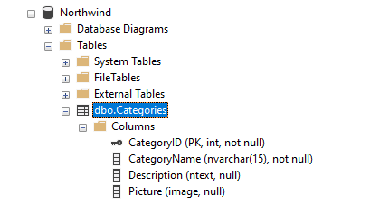
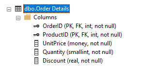
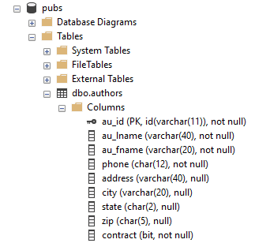

## Getting started

Download Persism [here](https://github.com/sproket/Persism/releases) and add it your project.

Persism uses a standard Connection object so all you need to do is Create the Session object 
passing in the Connection.

Here's a common method to do this:
```
    Properties props = new Properties();
    props.load(getClass().getResourceAsStream("/mydb.properties"));
    
    String driver = props.getProperty("database.driver");
    String url = props.getProperty("database.url");
    String username = props.getProperty("database.username");
    String password = props.getProperty("database.password");
    
    Class.forName(driver);
    
    Connection con = DriverManager.getConnection(url, username, password);
    
    // Instantiate a Persism session object with the connection
    Session session = new Session(con);
```

## Querying Data

With the session object you can then run queries to retrieve lists of objects:
```
    List<Customer> list = session.query(Customer.class,"select * from Customers where name = ?", "Fred");
    // or
    List<Customer> list = session.query(Customer.class, "sp_FindCustomers(?)", "Fred");

```

**Note:** Generics are in place here. If you try querying for a list of a mismatched type, 
you'll get a compiler error. Note also that the query follows the best practice of using 
parameterized queries, and you can also use stored procedures instead of query strings.

You can also read a single object with a query string like this:

```
    Customer customer;
    customer = session.query(Customer.class, "select * from Customers where name = ?", "Fred");
    // or   customer = session.query(Customer.class, "sp_FindCustomer(?)", "Fred");
    if (customer != null) {
        // etc...
    }
```
This method returns null if the customer was not found.

You can also quickly initialize an Object from the database by specifying the Object's primary key. This way you do not need any SQL statement.

```
    Customer customer = new Customer();
    customer.setCustomerId(123);
    if (session.fetch(customer)) {
        // customer found
    } 
```
This method returns true to indicate the object was found and initialized. Note you do this 
by pre-instantiating your object first. This allows you to control memory usage of your objects, 
so you can re-use the same object if you need to run multiple queries.

The query can also return primitive Java types by simply using them directly.
```
    String result = session.query(String.class, "select Name from Customers where ID = ?", 10);
    int count = session.query(int.class, "select count(*) from Customers where Region = ?", Region.West)
    // Note Enums are supported 
```

## Updating Data

With the session object you can perform inserts, updates and deletes with data objects.

To perform an operation simply use the appropriate method.
### Insert
```
Customer customer = new Customer();
customer.setCustomerId(123);
customer.setCustomerName("Fred");
customer.setAddress("123 Sesame Street");

session.insert(customer); // insert new Customer

// or with autoinc
Customer customer = new Customer();
customer.setCustomerName("Fred");
customer.setAddress("123 Sesame Street");

session.insert(customer); // insert new Customer

// Inserted and new autoinc value assigned 
assert customer.getCustomerId() > 0
```
**Note:**  Persism detects if a String is longer than the specified width in the database and will trim it 
before inserting into the DB - avoiding a DB Truncation error. Persism will log a warning when that occurs. 

### Update
```
    customer.setCustomerName("Barney");
    sesion.update(customer); // Update Customer   
```

**Note:** If your POJO extends *PersistableObject* or implements *Persistable* then only the changed columns will 
be used in the update statement.

**Note:**  Persism detects if a String is longer than the specified width in the database and will trim it
before updating the DB - avoiding a DB Truncation error. Persism will log a warning when that occurs.

### Delete
```
session.delete(customer); // Delete Customer
```

Persism will use the primary keys for the update and delete methods and will set the primary key 
for you if it is and autoincrement when you do an insert. 

Persism will usually auto-discover the primary keys, so you usually do not have to specify them 
in your POJO. Persism will also set defaults to properties if they were not defined and there's 
a default defined for that mapped column in the database.

## Writing Data Objects (POJOs)

Persism follows the usual JavaBean convention for data objects exactly as you would define Entity type objects
with JPA - though you won't need all those annotations which seem to be required with that framework. ;)

Examples come from [Northwind and Pubs Databases](https://docs.microsoft.com/en-us/dotnet/framework/data/adonet/sql/linq/downloading-sample-databases)

Let's take the Categories table from Northwind:



Here's the class for this:
```
public class Category {

    private int categoryId;
    private String categoryName;
    private String description;
    private byte[] picture;

    // Getters and Setters etc..
}
```

**Note:** You don't need any annotation in this case. Persism will match columns to property names ignoring 
case or spaces or underscores in the column names - and it will also match up the table name handling the 
singular/plural naming as well.  

This would work fine if the table was called "Category" or "CATEGORY" or "CATEGORIES". You'd only need an 
annotation if the table had an unusual name.    

**Note:** The binary Picture (Blob) column maps into byte array. This works fine for both reading 
and writing back to the database.

Here's another example from Northwind:



Here's the class for this:

```
public class OrderDetail {

    private int orderId;
    private int productId;
    private BigDecimal unitPrice;
    private int quantity;
    private BigDecimal discount;

    // Getters and Setters etc..  
}
```

**Note:** You don't need to annotate for the table name even though it has a space in it.

You could also specify your types with doubles or floats like this:

```
public class OrderDetail {

    private int orderId;
    private int productId;
    private double unitPrice;
    private int quantity;
    private double discount;

    // Getters and Setters etc..  
}
```

In this situation, Persism will log a warning if it needs to 'downcast' because the database may return a larger type than 
you specified in your class.

```
WARN - Possible overflow column UnitPrice - Property is Double and column value is BigDecimal
```

## Annotations

Persism uses annotation in situations where it can't discover the mapping for you.

Let's look at the PUBS database for this:



Hmm, some funny names here. Here's a class for that:

```
@Table("author") // not really required in this case
public class Author {

    @Column(name = "aU_iD") // Usually case won't matter for the annotation
    private String authorId;

    @Column(name = "au_LNAME")
    private String lastName;

    @Column(name = "au_FNAME")
    private String firstName;

    private String phone;
    private String address;
    private String city;
    private String state;

    @Column(name = "zIp")
    private String postalCode;

    private boolean contract;
    
    // Getters and Setters etc..
}
```

Persism uses the following annotations for Table which need to be specified on the Class:

- *Table* - used to specify the table name in the database.
- *NotTable* - used to specify that this class represents the result of a query - that there is no 
single table associated with it.

Persism uses the following annotations for Columns.

- *Column* - used to specify the column name and whether the column is primary, autoincrement or has a default. 
The 3 parameters are optional.
- *NotColumn* - used to specify that this property has no matching column. Ie that it's a calculated value and not read from the database.

**Note:** These annotations can be specified on the field or on the getter or setter. 

**Note:** *NotColumn* is not required if your property has a getter only. Persism understands that a 
read-only property would not be in the database.


## Support for hierarchical objects
None.

## Data types for properties etc...

TODO Add support in Java 8 for new DateTime api DONE minues tinezome

## Known Issues

- No support yet for newer Timezone related date types
- Boolean type columns using "Is" style names will require annotations 
- Generated primary keys only work with Auto-increment types. UUID/String types with generated defaults do not return into the inserted object
- Singular/plural table name guessing does not work with words like Tax - Taxes, Fax - Faxes


